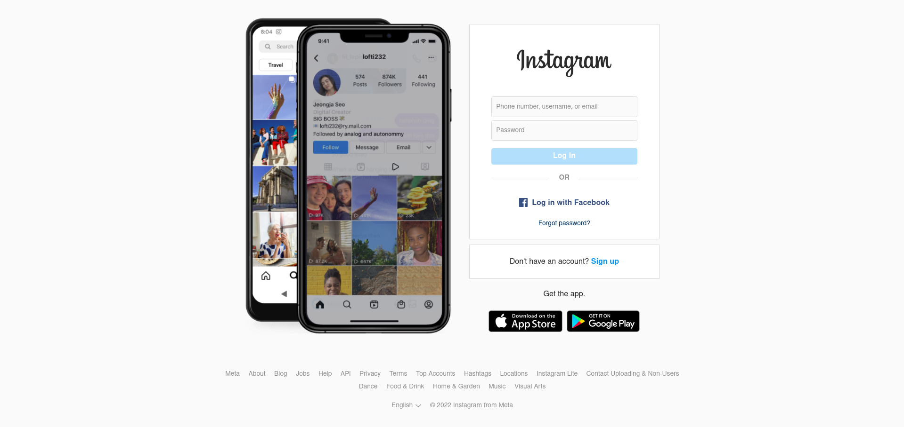
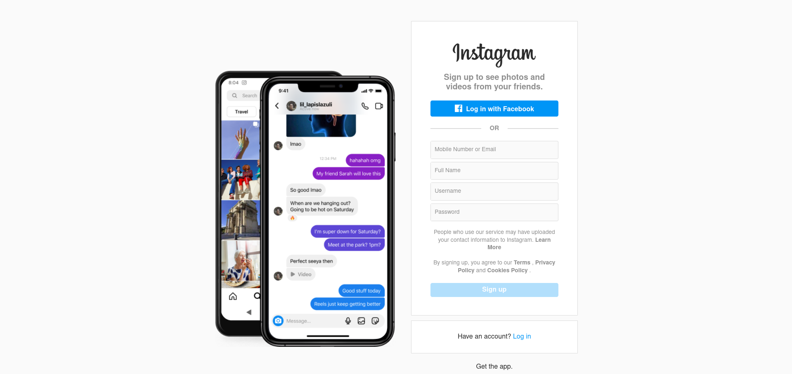

# Exercise Lab

Today's lab includes the use of routers and a hint of today's topic (state management)

you are required to implement the following page as is

you also need to implement the register page

try to make them as functional as you can

more details to come...

Good luck.